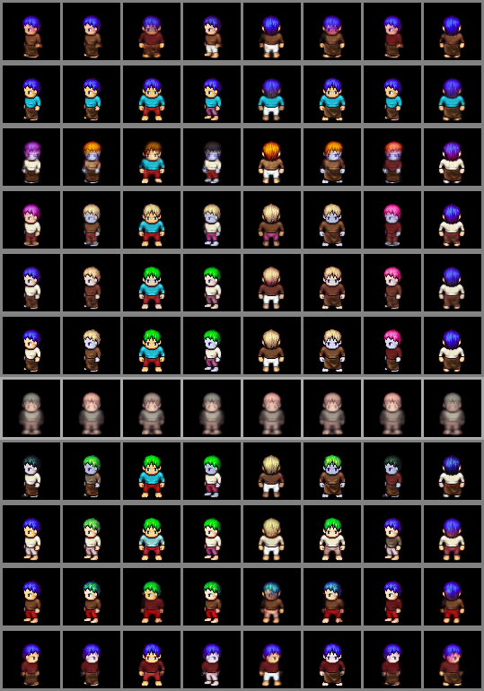
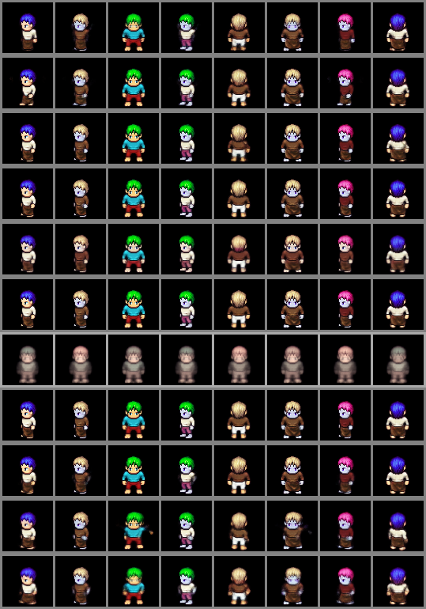

# Learning-disentanglement-for-Sequential-Data
Implementation of VAE-based methods to learn disentangled representations for sequential data, e.g. Videos and Speech.


#### Implemented Methods
* [FHVAE](https://arxiv.org/abs/1709.07902)
* [DSVAE](https://arxiv.org/abs/1803.02991)
    * DSAE model for videos (LPC-dataset)
    * DSAE model for audio (Timit-Dataset)
* [SpeechVAE](https://arxiv.org/abs/1704.04222)
* [Dynamical VAEs](https://arxiv.org/pdf/2008.12595.pdf)
    * Deep Kalman Filter (DKF)
    * Kalman Variational Autoencoders (KVAE)
    * STOchastic Recurrent Networks (STORN)
    * Variational Recurrent Neural Networks (VRNN)
    * Stochastic Recurrent Neural Networks (SRNN)
    * Recurrent Variational Autoencoders (RVAE)
<!--* [S3VAE](https://openaccess.thecvf.com/content_CVPR_2020/papers/Zhu_S3VAE_Self-Supervised_Sequential_VAE_for_Representation_Disentanglement_and_Data_Generation_CVPR_2020_paper.pdf)
-->

#### Requirements
The experiments were performed using Python 3.8.5 with the following Python packages:
- [numpy](http://www.numpy.org/) == 1.18.5
- [torch](https://pytorch.org/) == 1.5.1
- [torchvision](https://pypi.org/project/torchvision/) = 0.6.1
- [matplotlib](https://pypi.org/project/matplotlib/) == 3.3.3
- [scipy](https://pypi.org/project/scipy/) == 1.5.4
- [pandas](https://pypi.org/project/pandas/) == 0.25.3
- [soundfile](https://pypi.org/project/SoundFile/) == 0.10.3
- [librosa](https://pypi.org/project/librosa/) == 0.6.3

### Timit preprocessing
First, you should download TIMIT dataset from its [original site](https://data.deepai.org/timit.zip), then run the following bash to preprocess it based on the approach adopted in [HFVAE paper](https://arxiv.org/abs/1709.07902):
```
chmod +x run_preprocess.sh
./run_preprocess.sh
```

### Experiments on LPC-Dataset
In order to compare the effects of different losses added to the standrad DSAE architecture, the following two figures present the effects of adding a random vector to the static latent variables (left) and to the dynamic latent variables (right). First row presents original data,
second row corresponds to the original DSAE, third, fourth and fifth rows correspond to
DSAE with SCC loss for lamda equal to 1., 10. and 100. respectively. The next three
row represent DSAE with cyclic loss for lamda equal to 1., 0.1 and 10. respectively. The
last four rows correspond to DSAE with mutual MI loss, MI with cyclic losses, MI with
SCC losses and MI, SCC and Cyclic losses respectively.
<p float="center">
   
   
</p>

#### Acknowledgements
1. FHVAE implementation by [Hsu](https://github.com/wnhsu/FactorizedHierarchicalVAE/).
2. DSVAE implementation by [mazzzystar](https://github.com/mazzzystar/Disentangled-Sequential-Autoencoder).
3. DSVAE implementation by [yatindandi](https://github.com/yatindandi/Disentangled-Sequential-Autoencoder).
4. SppechVAE implementation by [edchengg](https://github.com/edchengg/generative_model_speech).
5. Hessian penalty implementation by [wpeebles](https://github.com/wpeebles/hessian_penalty).
6. Implementattion of several dynamical VAEs by [Xiaoyu Bie](https://github.com/XiaoyuBIE1994/DVAE-speech).
